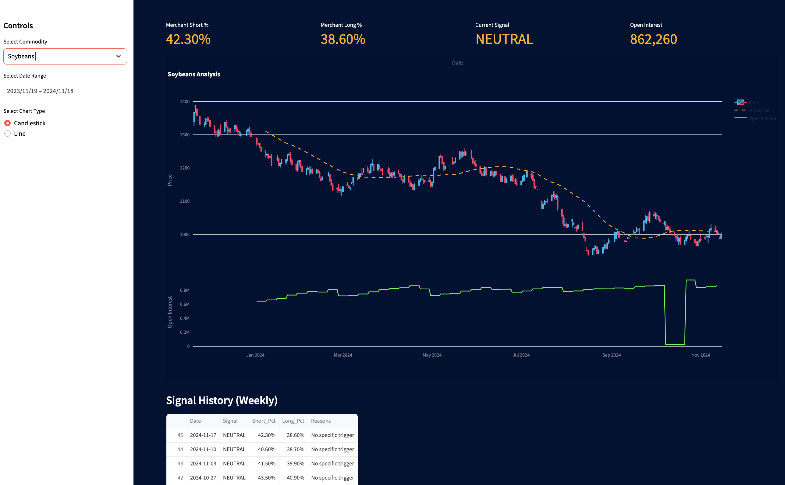

# Commodity Charter Pro

[](https://github.com/norandom/commodity-charter/actions/workflows/build.yml)
[](https://codecov.io/gh/norandom/commodity-charter)

A comprehensive financial analytics dashboard for commodity market analysis with advanced COT (Commitments of Traders) insights.



## Features

- **Real-time Price Data**: Integration with Yahoo Finance for up-to-date commodity prices
- **COT Analysis**: Advanced analysis of CFTC Commitments of Traders data
- **Merchant Position Tracking**: Analysis of commercial trader positions and their success rate
- **Signal Generation**: Automated trading signals based on merchant positioning
- **Interactive Visualization**: Bloomberg terminal-style interface with candlestick charts and technical indicators
- **Multiple Commodities**: Support for major commodities including:
  - Crude Oil
  - Natural Gas
  - Gold
  - Silver
  - Copper
  - Corn
  - Soybeans
  - Wheat

## Installation

### Using Docker (Recommended)

1. Clone the repository:
   ```bash
   git clone https://github.com/norandom/commodity-charter.git
   cd commodity-charter
   ```

2. Run with Docker Compose:
   ```bash
   docker-compose up --build
   ```

3. Access the application at `http://localhost:8501`

### Manual Installation

1. Clone the repository:
   ```bash
   git clone https://github.com/norandom/commodity-charter.git
   cd commodity-charter
   ```

2. Create and activate a virtual environment:
   ```bash
   python -m venv venv
   source venv/bin/activate  # On Windows: venv\Scripts\activate
   ```

3. Install dependencies:
   ```bash
   pip install -r requirements.txt
   ```

4. Run the application:
   ```bash
   streamlit run app.py
   ```

## Configuration

### Signal Ranges
Configure commodity-specific signal ranges in `cot_signals.csv`:
- Bullish Range: Percentage of short positions indicating bullish signal
- Bearish Range: Percentage of long positions indicating bearish signal

## Development

### Running Tests
```bash
pytest --cov=./ --cov-report=term-missing
```

### Code Style
```bash
flake8 .
```

### Docker Development
For development with hot-reload:
```bash
docker-compose up --build
```

## Technical Details

### Architecture
- **Frontend**: Streamlit web interface
- **Data Sources**: 
  - Yahoo Finance API
  - CFTC (Commodity Futures Trading Commission)
- **Analysis**: 
  - 50-day trend analysis
  - Weekly signal generation
  - Merchant position correlation

### Key Components
1. **Price Analysis**
   - Candlestick/Line charts
   - 50-day moving average
   - Volume tracking

2. **COT Analysis**
   - Merchant position percentages
   - Weekly signal generation
   - Position success rate tracking

3. **Open Interest Analysis**
   - Trend change detection
   - Peak analysis
   - Correlation with price movements

## Contributing

1. Fork the repository
2. Create your feature branch (`git checkout -b feature/AmazingFeature`)
3. Commit your changes (`git commit -m 'Add some AmazingFeature'`)
4. Push to the branch (`git push origin feature/AmazingFeature`)
5. Open a Pull Request

## License

This project is licensed under the MIT License - see the [LICENSE](LICENSE) file for details.

## Acknowledgments

- Data provided by Yahoo Finance and CFTC
- Inspired by professional trading terminals
- Built with Streamlit and Python
